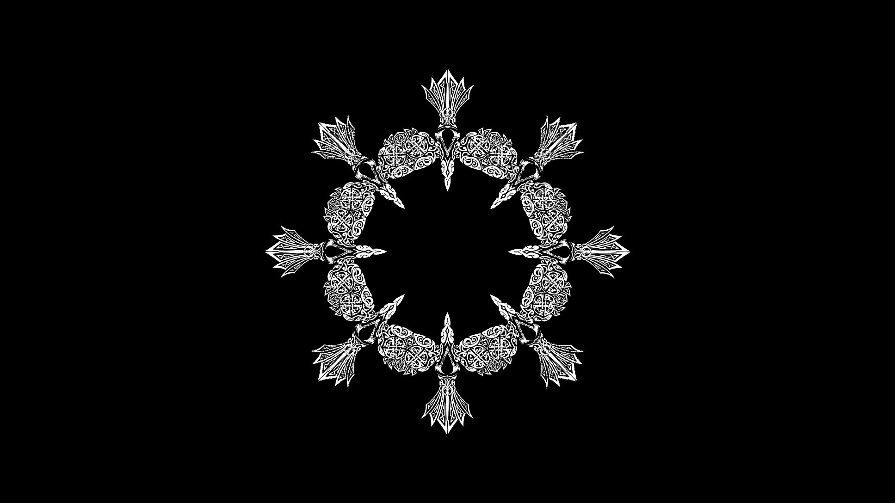

<div align="center">

# Kaleidoscope Library
A library to create kaleidoscope effect on images. You can build on all platforms using CMake.

[]()
[]()
[]()
[]()
[]()
[]()
[]()
</div>

## Building

Use the following commands,

```
mkdir build && cd build
cmake ..
cmake --build .
```

## Usage

The library have a simple usage you only need three functions to use. Check the sample usage at ```src/kaleidoscope-cmd.c```

- Initialization of the transformation matrix: ```int initKaleidoscope(KaleidoscopeHandle *handler, int n, int width, int height, double scaleDown)```
- Processing image (Can be used multiple times if the input image has same dimensions): ```void processKaleidoscope(KaleidoscopeHandle *handler, double k, ImageData *imgIn, ImageData *imgOut)```
- Deinitialization of the transformation matrix: ```void deInitKaleidoscope(KaleidoscopeHandle *handler)```

Alternatively you can directly use the command line program to create kaleidoscope effect!

```./kaleidoscope <Input Image Path> <Output Image Path> <N> ```

You can see an example below for ```N=8```

<div align="center">
     
    <br>
    <small>Image source: AC Valhalla</small>
</div>

## Benchmark

It is really fast! On a Intel i7-11800H CPU it achieves ~135 FPS for a Full HD (1920 x 1080) image on single thread

If you want to benchmark code on your system use this command,

```./kaleidoscope <Input Image Path> <Output Image Path> <N> <Number of loop>```
