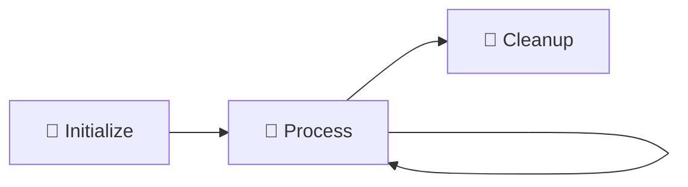

<div align="center">


<h3>🌈✨ Transform Images into Mesmerizing Kaleidoscope Art ✨🌈</h3>

<p>
<strong>A blazingly fast, cross-platform library to create stunning kaleidoscope effects on images</strong><br>
<em>Built with ❤️ using C, C++, Python, and CUDA</em>
</p>

---

### 📊 **Project Status**


### 🛠️ **Technology Stack**


</div>

---

## 🎯 **What is LibKaleidoscope?**

LibKaleidoscope is a **high-performance**, **cross-platform** library that transforms ordinary images into breathtaking kaleidoscope patterns. Written in C with FFI support, it offers seamless integration with multiple programming languages and includes GPU acceleration for ultimate performance.

> 🔗 **Learn More**: Check out the [mathematical explanation](https://egecetin.github.io/Projects/kaleidoscope) of the kaleidoscope effect!


## 🌟 **Key Features**

<div align="center">

| 🚀 **Performance** | 🌐 **Multi-Language** | 🎨 **Easy to Use** | ⚡ **GPU Accelerated** |
|:---:|:---:|:---:|:---:|
| Ultra-fast processing with optimized algorithms | C, C++, Python, CUDA support | Simple 3-function API | CUDA backend for maximum speed |

</div>

---

## 🎭 **Supported Languages**

<details>
<summary><strong>🔍 Click to see language details</strong></summary>

### 🎯 **Core Languages**

| Language | Purpose | Features |
|:---------|:--------|:---------|
| **🔧 C** | Main programming language | Core library, maximum performance |
| **⚡ C++** | Header-only binding | Easy integration, STL compatibility |
| **🐍 Python** | Cython bindings | PyPI package, Pythonic interface |
| **🚀 CUDA** | GPU computing | Parallel processing, extreme performance |

</details>

---

## 📦 **Quick Installation**

### 🐍 **Python Users (Recommended)**

```bash
# 🎉 One-liner installation from PyPI
pip install LibKaleidoscope
```

> 💡 **Pro Tip**: Check `python/python-test.py` for example usage!

---

## 🛠️ **Building from Source**

<details>
<summary><strong>🏗️ Standard Build</strong></summary>

```bash
# 🚀 Quick build commands
mkdir build && cd build
cmake -DCMAKE_BUILD_TYPE=Release ..
cmake --build . --parallel
```

</details>

<details>
<summary><strong>⚡ CUDA-Enabled Build</strong></summary>

> ⚠️ **IMPORTANT**: CUDA Toolkit must be installed and available on your system before building with CUDA support. Download from [NVIDIA Developer](https://developer.nvidia.com/cuda-downloads).

```bash
# 🔥 GPU-accelerated build
mkdir build && cd build
cmake -DCMAKE_BUILD_TYPE=Release -DKALEIDOSCOPE_ENABLE_CUDA=ON ..
cmake --build . --parallel
```

</details>

<details>
<summary><strong>🔧 Custom Build Options</strong></summary>

```bash
# 🎛️ Disable command line tool (reduces dependencies)
cmake -DCMAKE_BUILD_TYPE=Release -DKALEIDOSCOPE_ENABLE_CMD_TOOL=OFF ..
```

> 📝 **Note**: The libjpeg-turbo dependency is only for testing and demo purposes

</details>

---

## 🎯 **Usage Guide**

### 🎪 **Simple 3-Step API**

LibKaleidoscope makes image transformation incredibly simple with just **3 functions**:



<details>
<summary><strong>🔍 C API Reference</strong></summary>

| Step | Function | Purpose |
|:----:|:---------|:--------|
| **1️⃣** | `initKaleidoscope()` | Initialize transformation matrix |
| **2️⃣** | `processKaleidoscope()` | Process images (reusable for same dimensions) |
| **3️⃣** | `deInitKaleidoscope()` | Clean up resources |

```c
// 🎯 Step 1: Initialize
int initKaleidoscope(KaleidoscopeHandle *handler, int n, int width, int height, double scaleDown);

// 🎨 Step 2: Process (use multiple times)
void processKaleidoscope(KaleidoscopeHandle *handler, double k, unsigned char *imgIn, unsigned char *imgOut);

// 🧹 Step 3: Cleanup
void deInitKaleidoscope(KaleidoscopeHandle *handler);
```

> 📚 **Example**: Check `src/kaleidoscope-cmd.c` for complete usage

</details>

### 🖥️ **Command Line Magic**

Transform images instantly with the command line tool:

```bash
# ✨ Create kaleidoscope effect (N=8 segments)
./kaleidoscope-cmd <Input_Image> <Output_Image> <N>
```

### 🎨 **Visual Example**

<div align="center">
     ➡️ 
    <br>
    <em>🎮 Original → Kaleidoscope (N=8)</em><br>
    <small>Image source: AC Valhalla</small>
</div>

---

### 💻 **Programming Language Examples**

<details>
<summary><strong>⚡ C++ Header-Only Binding</strong></summary>

```cpp
#include <kaleidoscope.hpp>

int main() {
    // 🎯 One-line initialization with all parameters
    kalos::Kaleidoscope handler(n, width, height, nComponents, scaleDown, k);

    // 🎨 Process your image data
    handler.processImage(inData, outData, nPixel);

    // 🧹 Automatic cleanup when handler goes out of scope
    return 0;
}
```

> 🚀 **Advantage**: RAII-style resource management, exception safety

</details>

<details>
<summary><strong>🔥 CUDA GPU Backend</strong></summary>

```cpp
#include <cuda/kaleidoscope.cuh>

int main() {
    // 🚀 GPU-accelerated kaleidoscope
    kalos::cuda::Kaleidoscope handler(n, width, height, nComponents, scaleDown, k);

    // ⚡ Ultra-fast GPU processing
    // ⚠️ Important: inData and outData must be device-allocated!
    handler.processImage(inData, outData, nPixel);

    return 0;
}
```

> 💡 **Performance Tip**: Ensure your data is allocated on GPU memory for maximum speed

</details>

> 🧪 **Examples**: See `tests/processingTest.cpp` and `tests/processingTest.cu` for complete implementations

---

## 🚀 **Performance Benchmarks**

### ⚡ **Lightning Fast Performance**

> **Hardware**: Intel i7-11800H CPU

<div align="center">

| 🎥 **Resolution** | 📊 **FPS** | 🎯 **Use Case** |
|:------------------|:-----------|:----------------|
| 🔥 **4K UHD** (3840×2160) | **~65 FPS** | Professional video editing |
| 🎬 **Full HD** (1920×1080) | **~265 FPS** | Real-time streaming |
| 📺 **720p** (1280×720) | **~640 FPS** | Gaming overlays |
| 📱 **576p** (720×576) | **~1350 FPS** | Mobile apps |

</div>

### 📈 **Performance Visualization**

<div align="center">
    
</div>

<details>
<summary><strong>🔬 Mathematical Formula</strong></summary>

The performance follows an exponential decay model:

$$\Large FPS = a \cdot e^{b \cdot nPixels} + c \cdot e^{d \cdot nPixels}$$

**Where:**
- $a = 2492$
- $b = -2.165 \times 10^{-6}$
- $c = 364.9$
- $d = -2.08 \times 10^{-7}$

</details>

### 🏃‍♂️ **Benchmark Your System**

```bash
# 🎯 Test performance on your hardware
./kaleidoscope-cmd <Input_Image> <Output_Image> <N> <Number_of_loops>
```

> ⚠️ **Important**: Use `-DCMAKE_BUILD_TYPE=Release` for accurate benchmarks

---

## 🤝 **Contributing**

We welcome contributions! Please feel free to submit issues, feature requests, or pull requests.

## 📄 **License**

This project is licensed under the terms of MIT License.

---

<div align="center">

### 🌟 **Star this repo if you found it useful!** 🌟

Made with ❤️ by [egecetin](https://github.com/egecetin)

</div>
