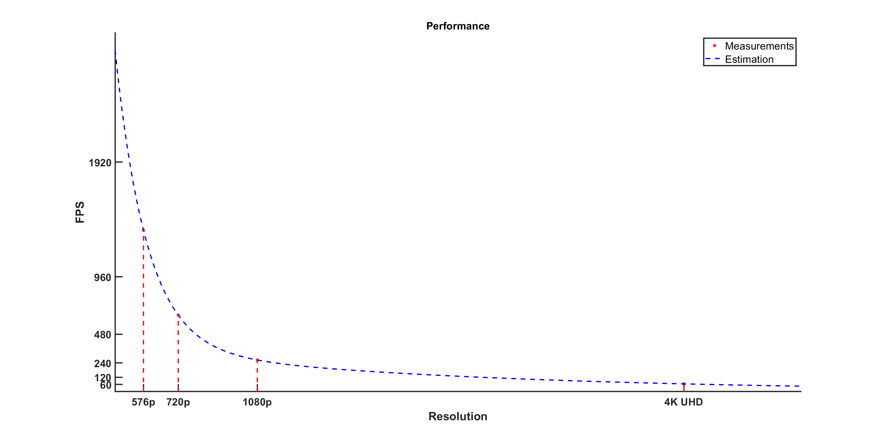

<div align="center">

<picture>
<source media="(prefers-color-scheme: dark)" srcset="doc/images/logo-white.png"/>

</picture>
<br>

A library to create kaleidoscope effect on images. You can build on all platforms using CMake.


</div>

## Building

Use the following commands,

```
mkdir build && cd build
cmake -DCMAKE_BUILD_TYPE=Release ..
cmake --build . --parallel
```

## Usage

The library has a simple usage and you need only three functions to use it. Check the sample usage at ```src/kaleidoscope-cmd.c```

- Initialization of the transformation matrix: ```int initKaleidoscope(KaleidoscopeHandle *handler, int n, int width, int height, double scaleDown)```
- Processing image (Can be used multiple times if the input images have same dimensions): ```void processKaleidoscope(KaleidoscopeHandle *handler, double k, unsigned char *imgIn, unsigned char *imgOut)```
- Deinitialization of the transformation matrix: ```void deInitKaleidoscope(KaleidoscopeHandle *handler)```

Alternatively you can directly use the command line program to create kaleidoscope effect with ```./kaleidoscope-cmd <Input Image Path> <Output Image Path> <N>```. You can see an example below for ```N=8```
<div align="center">
     
    <br>
    <small>Image source: AC Valhalla</small>
</div>

## Benchmark

It is really fast! On a Intel i7-11800H CPU it achieves,

- ~65 FPS for 4K UHD (3840 x 2160)
- ~265 FPS for Full HD (1920 x 1080)
- ~640 FPS for 720p (1280 x 720)
- ~1350 FPS for 576p (720 x 576)

resolution images. The performance estimation can be seen at the below

<div align="center">
    <picture>
    <source media="(prefers-color-scheme: dark)" srcset="doc/images/performance-white.png"/>
    
    </picture>
</div>

$$ FPS = a\text{ }e^{b\text{ }nPixels}+c\text{ }e^{d\text{ }nPixels} $$

$$ a = 2492 \text{, } b = -2.165\text{ }10^{-6} \text{, } c = 364.9 \text{, } d = -2.08\text{ }10^{-7} $$

If you want to benchmark code on your system make sure you configured with ```-DCMAKE_BUILD_TYPE=Release``` and use this command,

```./kaleidoscope-cmd <Input Image Path> <Output Image Path> <N> <Number of loop>```
